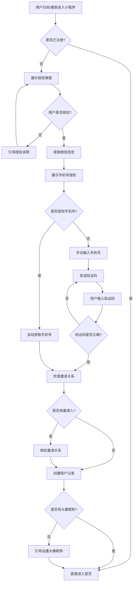
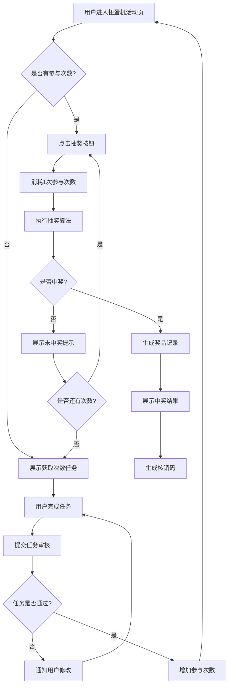
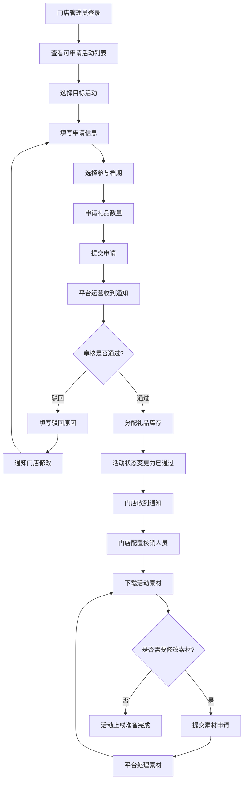
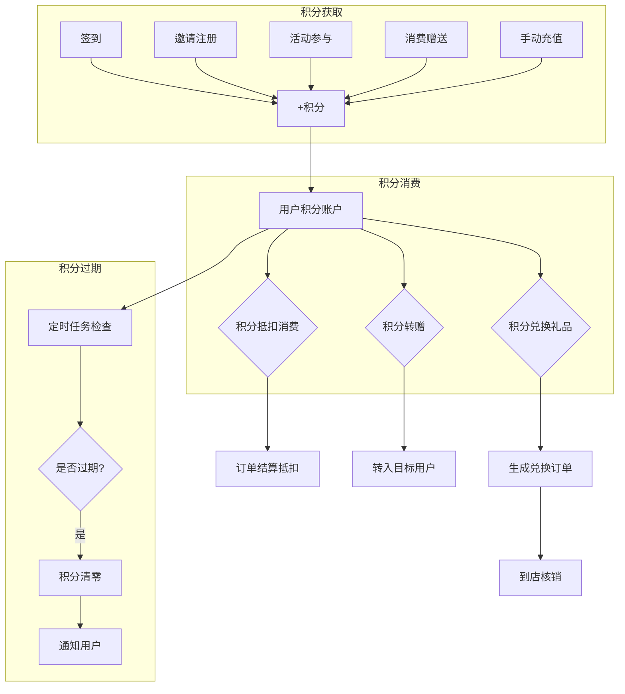

# Carclub汽车会员系统需求规格说明书

---

## 文档信息

| 项目 | 内容 |
|------|------|
| 文档名称 | Carclub汽车会员系统需求规格说明书 |
| 版本 | V2.0 |
| 创建日期 | 2026-01-06 |
| 文档状态 | 正式版 |

### 修订历史

| 版本 | 日期 | 修订内容 | 修订人 |
|------|------|----------|--------|
| V1.0 | 2026-01-06 | 初始版本，整合三端需求 | - |
| V2.0 | 2026-01-06 | 补充业务背景、用户画像、流程图、验收标准等 | - |

### 术语表

| 术语 | 英文 | 说明 |
|------|------|------|
| 小程序端 | Mini Program | 面向消费者的微信小程序应用 |
| 门店端 | Merchant App | 面向店长/店员的移动端管理应用 |
| 管理端 | Admin Portal | 面向平台运营的后台管理系统 |
| 经营主体 | Business Entity | 商家的法律实体，一个主体可绑定多个门店 |
| 企微 | WeCom | 企业微信 |
| 核销 | Redemption | 用户获奖后到店兑换礼品的验证流程 |
| 裂变 | Viral Marketing | 通过现有用户邀请新用户的营销方式 |
| 扭蛋机 | Gashapon | 一种游戏化抽奖活动形式 |
| 线索 | Lead | 潜在客户信息 |
| DMS | Dealer Management System | 经销商管理系统 |
| RBAC | Role-Based Access Control | 基于角色的访问控制 |
| DAU | Daily Active Users | 日活跃用户数 |
| MAU | Monthly Active Users | 月活跃用户数 |
| GMV | Gross Merchandise Volume | 成交总额 |

---

## 第一部分：项目概述

### 1.1 行业背景与痛点分析

#### 1.1.1 行业现状

汽车经销商行业正面临数字化转型的关键时期：

| 维度 | 现状 | 影响 |
|------|------|------|
| 获客成本 | 单客获取成本持续攀升，传统广告效果下降 | 利润空间压缩 |
| 客户粘性 | 售后客户流失率高达40-60% | 复购率低 |
| 营销效率 | 活动触达率低，转化效果难以量化 | 营销ROI不清晰 |
| 数据孤岛 | 各门店数据割裂，难以形成统一画像 | 精准营销受阻 |
| 私域运营 | 缺乏系统化的会员运营体系 | 用户价值未充分挖掘 |

#### 1.1.2 目标用户痛点

**消费者痛点**：
- 品牌活动信息获取渠道分散，容易错过优惠
- 积分/权益分散在各门店，无法统一管理
- 缺乏便捷的线上预约和服务入口

**门店痛点**：
- 活动执行依赖人工，效率低下
- 客户信息管理不规范，流失严重
- 无法有效追踪营销活动ROI

**品牌方痛点**：
- 缺乏统一的会员运营平台
- 各门店数据不互通，难以形成品牌级洞察
- 营销资源分配缺乏数据支撑

### 1.2 项目定位

```
┌────────────────────────────────────────────────────────────────────┐
│                      Carclub汽车会员系统                              │
│                                                                    │
│   定位：面向汽车经销商的B2C会员营销SaaS平台                          │
│                                                                    │
│   ┌──────────────┐  ┌──────────────┐  ┌──────────────┐            │
│   │   获客引擎    │  │   留存引擎    │  │   转化引擎    │            │
│   │              │  │              │  │              │            │
│   │ - 裂变拉新   │  │ - 签到打卡   │  │ - 积分兑换   │            │
│   │ - 邀请注册   │  │ - 会员权益   │  │ - 活动核销   │            │
│   │ - 活动引流   │  │ - 互动游戏   │  │ - 线索转化   │            │
│   └──────────────┘  └──────────────┘  └──────────────┘            │
│                                                                    │
│   核心价值：降低获客成本 | 提升客户粘性 | 数据驱动决策               │
└────────────────────────────────────────────────────────────────────┘
```

### 1.3 项目目标与成功指标

#### 1.3.1 业务目标

| 目标类型 | 具体目标 | 衡量方式 |
|----------|----------|----------|
| 获客目标 | 通过裂变活动降低单客获取成本30% | 对比投放获客成本 |
| 留存目标 | 提升会员月活跃度至40%以上 | MAU/总会员数 |
| 转化目标 | 提升售后服务复购率20% | 年度复购订单数 |
| 运营目标 | 实现活动执行效率提升50% | 活动从创建到上线时间 |

#### 1.3.2 关键成功指标（KPI）

**用户增长指标**：

| 指标 | 定义 | 目标值 | 统计周期 |
|------|------|--------|----------|
| 新增注册用户 | 通过小程序完成注册的用户数 | 5000+/月/门店 | 月度 |
| 裂变系数 | 平均每个老用户带来的新用户数 | ≥1.5 | 活动周期 |
| 邀请转化率 | 被邀请用户完成注册的比例 | ≥30% | 活动周期 |

**用户活跃指标**：

| 指标 | 定义 | 目标值 | 统计周期 |
|------|------|--------|----------|
| DAU | 日活跃用户数 | 占注册用户10% | 日度 |
| MAU | 月活跃用户数 | 占注册用户40% | 月度 |
| 签到率 | 参与签到的用户占比 | ≥25% | 日度 |
| 活动参与率 | 参与营销活动的用户占比 | ≥35% | 活动周期 |

**业务转化指标**：

| 指标 | 定义 | 目标值 | 统计周期 |
|------|------|--------|----------|
| 积分消费率 | 积分被消费的比例 | ≥60% | 月度 |
| 礼品核销率 | 获奖用户到店核销比例 | ≥70% | 活动周期 |
| 线索转化率 | 线索转化为成交客户比例 | ≥15% | 月度 |

### 1.4 系统边界

#### 1.4.1 系统范围

**包含（In Scope）**：
- 会员注册与认证
- 积分获取与消费
- 营销活动管理（签到、抽奖、裂变、邀请）
- 门店管理与审核
- 活动素材管理
- 数据统计与分析
- 多租户支持

**不包含（Out of Scope）**：
- 车辆维修保养预约（Phase 2）
- 在线商城购物（Phase 2）
- 二手车交易（Phase 3）
- 金融分期服务（不在规划内）
- 车险业务（不在规划内）

#### 1.4.2 系统上下文图

```
                    ┌─────────────────┐
                    │   微信开放平台   │
                    │  (授权/支付)    │
                    └────────┬────────┘
                             │
    ┌──────────────┐         │         ┌──────────────┐
    │   企业微信    │◄────────┼────────►│   阿里云SMS   │
    │  (通知/绑定) │         │         │  (验证码)    │
    └──────────────┘         │         └──────────────┘
                             ▼
                    ┌─────────────────┐
    ┌──────────────►│                 │◄──────────────┐
    │               │   Carclub系统     │               │
    │               │                 │               │
    │               └─────────────────┘               │
    │                        │                        │
    ▼                        ▼                        ▼
┌─────────┐           ┌─────────┐           ┌─────────┐
│ 消费者   │           │ 门店员工 │           │ 平台运营 │
│(小程序) │           │(门店端) │           │(管理端) │
└─────────┘           └─────────┘           └─────────┘
                             │
                             ▼
                    ┌─────────────────┐
                    │     DMS系统     │
                    │  (线索同步)     │
                    └─────────────────┘
```

---

## 第二部分：用户研究

### 2.1 用户角色画像

#### 2.1.1 消费者用户画像

**主要用户：小李（潜在购车客户）**

| 维度 | 描述 |
|------|------|
| 人口特征 | 28岁，男性，一线城市白领，年收入20-30万 |
| 行为特征 | 习惯使用微信，关注汽车资讯，活跃于车友群 |
| 核心需求 | 了解品牌活动、获取购车优惠、便捷服务预约 |
| 痛点 | 不知道哪里有优惠、担心被坑、信息不透明 |
| 使用场景 | 通勤途中刷手机、周末看车、朋友聚会分享 |
| 期望价值 | 省钱、省心、有面子（分享优惠给朋友） |

**次要用户：王姐（已购车车主）**

| 维度 | 描述 |
|------|------|
| 人口特征 | 35岁，女性，家庭主妇，关注用车成本 |
| 行为特征 | 定期保养，关注优惠活动，愿意推荐好店 |
| 核心需求 | 积分兑换、保养优惠、会员专属权益 |
| 痛点 | 不知道积分怎么用、错过优惠活动 |
| 使用场景 | 保养前查询优惠、闲暇时签到积分 |
| 期望价值 | 省钱、被重视（VIP待遇） |

#### 2.1.2 门店端用户画像

**主要用户：张经理（门店店长）**

| 维度 | 描述 |
|------|------|
| 人口特征 | 38岁，男性，10年汽车行业经验 |
| 行为特征 | 关注业绩指标，管理团队，对接厂家 |
| 核心需求 | 提升门店业绩、高效管理活动、数据可视化 |
| 痛点 | 活动执行耗时、效果难量化、人员变动频繁 |
| 使用场景 | 晨会看数据、审批活动、查看客户信息 |
| 期望价值 | 业绩达标、管理省心、领导认可 |

**次要用户：小王（销售顾问）**

| 维度 | 描述 |
|------|------|
| 人口特征 | 25岁，男性，入行2年 |
| 行为特征 | 维护客户关系，跟进线索，完成销售任务 |
| 核心需求 | 获取客户线索、跟进客户状态、核销活动 |
| 痛点 | 客户信息分散、跟进效率低 |
| 使用场景 | 接待客户时核销、跟进线索客户 |
| 期望价值 | 多成单、少加班 |

#### 2.1.3 管理端用户画像

**主要用户：刘总监（品牌运营负责人）**

| 维度 | 描述 |
|------|------|
| 人口特征 | 42岁，女性，15年市场营销经验 |
| 行为特征 | 制定营销策略，审批活动方案，分析数据报表 |
| 核心需求 | 全网活动管理、数据分析决策、成本控制 |
| 痛点 | 各门店执行不一致、数据汇总困难 |
| 使用场景 | 周会看报表、审批活动、配置营销规则 |
| 期望价值 | ROI可控、品牌统一、领导满意 |

### 2.2 用户旅程地图

#### 2.2.1 消费者参与活动旅程

```
阶段      │  发现      │   注册     │   参与     │   获奖     │   核销     │   分享
──────────┼────────────┼────────────┼────────────┼────────────┼────────────┼────────────
触点      │ 朋友分享   │ 小程序     │ 活动页     │ 抽奖结果   │ 到店核销   │ 海报分享
          │ 扫码进入   │ 授权页     │            │ 页        │ 页        │
──────────┼────────────┼────────────┼────────────┼────────────┼────────────┼────────────
用户行为  │ 扫描二维码 │ 同意授权   │ 完成任务   │ 查看奖品   │ 出示核销码 │ 生成海报
          │ 打开小程序 │ 填写手机号 │ 点击抽奖   │            │            │ 发给好友
──────────┼────────────┼────────────┼────────────┼────────────┼────────────┼────────────
用户想法  │ 这是什么   │ 要授权？   │ 能中奖吗   │ 真的中了！ │ 怎么领？   │ 分享给
          │ 活动？     │ 安全吗？   │            │            │ 方便吗？   │ 朋友也玩
──────────┼────────────┼────────────┼────────────┼────────────┼────────────┼────────────
情绪曲线  │    😐      │    😟      │    🤔      │    😄      │    😊      │    😁
──────────┼────────────┼────────────┼────────────┼────────────┼────────────┼────────────
痛点      │ 不了解     │ 担心隐私   │ 任务繁琐   │ 奖品不实用 │ 核销麻烦   │ 海报丑
          │ 活动价值   │            │            │            │            │
──────────┼────────────┼────────────┼────────────┼────────────┼────────────┼────────────
机会点    │ 清晰的     │ 简化授权   │ 任务有趣   │ 奖品有吸   │ 一键核销   │ 海报美观
          │ 价值主张   │ 流程       │ 好玩       │ 引力       │            │ 易分享
```

#### 2.2.2 门店申请活动旅程

```
阶段      │  发现      │   申请     │   等待审核 │   准备执行 │   活动中   │   复盘
──────────┼────────────┼────────────┼────────────┼────────────┼────────────┼────────────
触点      │ 活动列表   │ 申请页     │ 审核状态   │ 素材下载   │ 核销页     │ 数据报表
          │ 页        │            │ 页        │ 页        │            │
──────────┼────────────┼────────────┼────────────┼────────────┼────────────┼────────────
用户行为  │ 浏览可参   │ 填写申请   │ 查看进度   │ 配置核销人 │ 扫码核销   │ 查看数据
          │ 与活动     │ 信息       │            │ 下载素材   │            │ 导出报表
──────────┼────────────┼────────────┼────────────┼────────────┼────────────┼────────────
用户想法  │ 哪个活动   │ 申请多少   │ 多久能批   │ 素材能改吗 │ 流程顺畅吗 │ 效果如何
          │ 适合我     │ 礼品合适   │ 下来？     │            │            │
──────────┼────────────┼────────────┼────────────┼────────────┼────────────┼────────────
痛点      │ 活动太多   │ 不知道申   │ 审核太慢   │ 素材不能   │ 核销繁琐   │ 数据不全
          │ 难选择     │ 请多少     │            │ 自定义     │            │
──────────┼────────────┼────────────┼────────────┼────────────┼────────────┼────────────
机会点    │ 推荐合适   │ 历史数据   │ 审核进度   │ 素材申请   │ 一键核销   │ 智能分析
          │ 的活动     │ 参考       │ 可视化     │ 流程       │            │ 建议
```

### 2.3 核心使用场景

#### 场景1：裂变拉新

```
场景名称：老带新裂变活动
参与角色：老用户A、新用户B、门店员工C

前置条件：
- 用户A已注册并绑定手机号
- 门店已开启裂变活动
- 活动库存充足

主流程：
1. 用户A在小程序首页看到"邀请好友赢大礼"活动入口
2. 用户A点击进入，查看活动规则和奖励说明
3. 用户A点击"生成专属海报"
4. 系统生成带有用户A专属二维码的海报
5. 用户A长按保存海报，通过微信分享给用户B
6. 用户B扫描海报二维码，进入小程序
7. 用户B完成注册，系统自动绑定邀请关系
8. 系统为用户A增加邀请计数
9. 当用户A邀请人数达到任务目标，系统发放奖励
10. 用户A收到奖励通知，可到店核销

异常流程：
- 用户B已是老用户：提示"该用户已注册，不计入邀请"
- 活动库存不足：提示"活动火爆，奖品已领完"
- 活动已结束：提示"活动已结束，敬请期待下次活动"
```

#### 场景2：签到积分

```
场景名称：每日签到赚积分
参与角色：用户A

前置条件：
- 用户A已注册
- 签到活动已开启
- 当日未签到

主流程：
1. 用户A打开小程序，进入"我的积分"页面
2. 看到签到入口和当前签到进度
3. 点击"签到"按钮
4. 系统校验今日是否已签到
5. 签到成功，展示获得的积分数
6. 展示连续签到天数和累计签到奖励进度
7. 若触发累计签到奖励，额外发放奖励积分

异常流程：
- 今日已签到：提示"今日已签到，明天再来哦"
- 签到活动未开启：不展示签到入口
```

#### 场景3：活动核销

```
场景名称：到店核销奖品
参与角色：用户A、门店员工B

前置条件：
- 用户A已获得活动奖品
- 员工B具有核销权限
- 门店系统正常

主流程：
1. 用户A到达门店，告知要核销奖品
2. 用户A打开小程序，进入"我的奖品"
3. 选择要核销的奖品，点击"出示核销码"
4. 系统生成动态核销码（有效期5分钟）
5. 员工B打开门店端，进入"核销"功能
6. 扫描用户A的核销码
7. 系统显示奖品信息，员工确认无误
8. 员工B点击"确认核销"
9. 系统记录核销信息，奖品状态变更为已核销
10. 用户A收到核销成功通知

异常流程：
- 核销码已过期：提示重新生成
- 奖品已核销：提示"该奖品已核销"
- 员工无核销权限：提示"无权限操作"
- 非本门店奖品：提示"该奖品仅限在xxx门店核销"
```

---

## 第三部分：业务流程

### 3.1 核心业务流程图

#### 3.1.1 会员注册流程



#### 3.1.2 活动参与流程（扭蛋机）



#### 3.1.3 门店活动申请流程



#### 3.1.4 积分获取与消费流程



### 3.2 状态机定义

#### 3.2.1 活动状态机

```
┌─────────┐    创建    ┌─────────┐    提交    ┌─────────┐
│  草稿   │──────────►│ 待审核   │──────────►│ 审核中   │
└─────────┘           └─────────┘           └─────────┘
                                                  │
                           ┌──────────────────────┤
                           │                      │
                           ▼ 驳回                 ▼ 通过
                      ┌─────────┐           ┌─────────┐
                      │ 已驳回   │           │ 已通过   │
                      └─────────┘           └─────────┘
                           │                      │
                           │ 修改重提             │ 到达开始时间
                           ▼                      ▼
                      ┌─────────┐           ┌─────────┐
                      │ 待审核   │           │ 进行中   │
                      └─────────┘           └─────────┘
                                                  │
                           ┌──────────────────────┤
                           │                      │
                           ▼ 手动终止             ▼ 到达结束时间
                      ┌─────────┐           ┌─────────┐
                      │ 已终止   │           │ 已结束   │
                      └─────────┘           └─────────┘
```

**状态说明**：

| 状态 | 状态码 | 说明 | 允许操作 |
|------|--------|------|----------|
| 草稿 | DRAFT | 活动创建中，未提交 | 编辑、删除、提交 |
| 待审核 | PENDING | 已提交，等待平台审核 | 撤回 |
| 审核中 | REVIEWING | 平台正在审核 | - |
| 已驳回 | REJECTED | 审核未通过 | 修改重提、放弃 |
| 已通过 | APPROVED | 审核通过，等待开始 | 配置素材、核销人 |
| 进行中 | ONGOING | 活动正在进行 | 查看数据、核销 |
| 已终止 | TERMINATED | 手动终止 | 查看数据 |
| 已结束 | FINISHED | 正常结束 | 查看数据、复盘 |

#### 3.2.2 奖品状态机

```
┌─────────┐   中奖发放   ┌─────────┐   用户申请   ┌─────────┐
│  待发放  │────────────►│ 待核销   │─────────────►│ 核销中   │
└─────────┘             └─────────┘              └─────────┘
                              │                       │
                              │ 过期                  │ 确认核销
                              ▼                       ▼
                        ┌─────────┐            ┌─────────┐
                        │ 已过期   │            │ 已核销   │
                        └─────────┘            └─────────┘
```

#### 3.2.3 审核工单状态机

```
┌─────────┐   提交申请   ┌─────────┐   开始处理   ┌─────────┐
│  待提交  │────────────►│ 待处理   │─────────────►│ 处理中   │
└─────────┘             └─────────┘              └─────────┘
                                                      │
                              ┌────────────────┬──────┴──────┐
                              │                │             │
                              ▼ 通过           ▼ 驳回        ▼ 需补充
                        ┌─────────┐      ┌─────────┐   ┌─────────┐
                        │ 已通过   │      │ 已驳回   │   │ 待补充   │
                        └─────────┘      └─────────┘   └─────────┘
                                               │             │
                                               │ 重新提交     │ 补充材料
                                               ▼             ▼
                                         ┌─────────┐   ┌─────────┐
                                         │ 待处理   │   │ 待处理   │
                                         └─────────┘   └─────────┘
```

---

## 第四部分：功能需求详述

### 4.1 小程序端功能需求

#### 4.1.1 注册登录模块

##### UC-001 微信授权登录

| 属性 | 描述 |
|------|------|
| **优先级** | P0（必须实现） |
| **用户故事** | 作为一名新用户，我希望通过微信快速登录，以便无需记忆账号密码即可使用系统 |
| **前置条件** | 用户已安装微信并登录 |
| **触发条件** | 用户首次打开小程序或登录态过期 |

**功能描述**：
- 调用微信授权获取用户基本信息（头像、昵称、性别）
- 调用微信授权获取用户手机号
- 支持拒绝授权后引导重新授权

**验收标准**：
- [ ] 首次进入显示授权弹窗
- [ ] 授权成功后获取用户微信信息
- [ ] 手机号授权支持一键获取
- [ ] 拒绝授权后可重新触发授权
- [ ] 授权信息正确存储到数据库
- [ ] 登录成功后跳转首页

**异常处理**：

| 异常场景 | 处理方式 |
|----------|----------|
| 用户拒绝基础授权 | 引导说明授权必要性，提供重试入口 |
| 用户拒绝手机号授权 | 提供手动输入手机号入口 |
| 网络异常 | 提示网络错误，提供重试按钮 |
| 微信服务异常 | 提示稍后重试 |

##### UC-002 信息设置

| 属性 | 描述 |
|------|------|
| **优先级** | P1（应该实现） |
| **用户故事** | 作为一名已注册用户，我希望只在必要时被要求设置头像昵称，以免频繁被打扰 |
| **依赖** | UC-001 |

**功能描述**：
- 检测用户是否已设置头像和昵称
- 仅在未设置时弹出设置界面
- 支持跳过设置，后续可在个人中心补充

**验收标准**：
- [ ] 已设置头像昵称的用户不弹出设置界面
- [ ] 未设置用户展示设置弹窗
- [ ] 支持"稍后设置"跳过
- [ ] 设置成功后更新用户信息

---

#### 4.1.2 门店首页模块

##### UC-005 网点定位

| 属性 | 描述 |
|------|------|
| **优先级** | P0 |
| **用户故事** | 作为一名用户，我希望看到附近的门店列表，以便选择最近的门店 |

**功能描述**：
- 获取用户当前位置（需授权）
- 按距离排序展示门店列表
- 支持切换城市筛选
- 展示门店基础信息（名称、地址、距离、营业状态）

**验收标准**：
- [ ] 进入页面触发定位授权
- [ ] 授权后展示附近门店列表
- [ ] 拒绝授权展示空状态引导
- [ ] 门店按距离升序排列
- [ ] 支持下拉刷新更新位置
- [ ] 门店卡片展示距离（km）

**界面要素**：

| 元素 | 说明 |
|------|------|
| 位置授权引导 | 首次进入或拒绝后展示 |
| 城市选择器 | 顶部切换城市 |
| 门店卡片 | 门店图片、名称、地址、距离、电话 |
| 空状态 | 附近暂无门店提示 |

##### UC-007 地址导航

| 属性 | 描述 |
|------|------|
| **优先级** | P1 |
| **用户故事** | 作为一名用户，我希望点击门店地址能直接导航，以便快速到达门店 |
| **依赖** | UC-005 |

**功能描述**：
- 点击门店地址/导航按钮
- 调用微信地图导航能力
- 支持选择导航App（高德/百度/腾讯）

**验收标准**：
- [ ] 点击导航按钮打开地图
- [ ] 地图显示门店位置标记
- [ ] 支持发起导航
- [ ] 导航终点为门店准确位置

---

#### 4.1.3 营销插件模块 - 扭蛋机

##### UC-010 抽奖活动

| 属性 | 描述 |
|------|------|
| **优先级** | P0 |
| **用户故事** | 作为一名用户，我希望参与扭蛋机抽奖活动，以便有机会获得礼品 |

**功能描述**：
- 展示扭蛋机活动页面
- 展示奖品池内容
- 展示剩余参与次数
- 点击抽奖触发动画
- 展示抽奖结果

**验收标准**：
- [ ] 活动页展示扭蛋机视觉
- [ ] 展示奖品列表和中奖概率
- [ ] 显示当前剩余次数
- [ ] 无次数时抽奖按钮置灰
- [ ] 抽奖过程有动画效果
- [ ] 中奖后展示恭喜弹窗
- [ ] 未中奖展示安慰提示

**业务规则**：

| 规则项 | 说明 |
|--------|------|
| 参与次数 | 通过完成任务获得，每次抽奖消耗1次 |
| 中奖概率 | 后台可配置，支持按用户群体差异化 |
| 奖品库存 | 库存为0时该奖品不再发放 |
| 保底机制 | 可配置N次未中奖必中（可选） |

##### UC-012 获奖记录

| 属性 | 描述 |
|------|------|
| **优先级** | P0 |
| **用户故事** | 作为一名中奖用户，我希望查看我的获奖记录和核销码，以便到店兑换 |
| **依赖** | UC-010 |

**功能描述**：
- 展示用户所有获奖记录
- 按状态筛选（待核销/已核销/已过期）
- 展示核销码和有效期
- 支持刷新核销码

**验收标准**：
- [ ] 列表展示所有获奖记录
- [ ] 支持状态筛选Tab
- [ ] 待核销奖品显示核销码
- [ ] 核销码支持放大展示
- [ ] 显示奖品有效期
- [ ] 过期奖品标记为已过期

---

#### 4.1.4 营销插件模块 - 裂变任务

##### UC-019 裂变海报生成

| 属性 | 描述 |
|------|------|
| **优先级** | P0 |
| **用户故事** | 作为一名用户，我希望生成专属邀请海报，以便分享给朋友参与活动 |

**功能描述**：
- 基于后台配置的模板生成海报
- 海报包含用户专属二维码
- 二维码携带邀请人参数
- 支持保存到手机相册

**验收标准**：
- [ ] 点击生成海报显示生成中
- [ ] 海报图片清晰（2倍图）
- [ ] 二维码可正常扫描
- [ ] 扫码进入绑定正确邀请关系
- [ ] 支持长按保存到相册
- [ ] 保存成功提示

**技术要求**：
- 海报尺寸：750x1334px
- 二维码大小：200x200px
- 支持自定义头像和昵称位置
- 图片格式：PNG

---

#### 4.1.5 营销插件模块 - 签到

##### UC-028 签到活动

| 属性 | 描述 |
|------|------|
| **优先级** | P0 |
| **用户故事** | 作为一名用户，我希望每天签到获得积分，以便积累积分兑换礼品 |

**功能描述**：
- 展示签到日历
- 展示当前连续签到天数
- 展示累计签到奖励进度
- 点击签到完成当日签到
- 展示获得的积分

**验收标准**：
- [ ] 展示本月签到日历
- [ ] 已签到日期有标记
- [ ] 显示连续签到天数
- [ ] 展示累计签到里程碑
- [ ] 签到成功弹窗显示积分
- [ ] 达成里程碑额外奖励

**业务规则**：

| 规则项 | 说明 |
|--------|------|
| 签到时间 | 每日0点重置，当日24点前有效 |
| 基础积分 | 每日签到固定积分（可配置） |
| 连续奖励 | 连续N天额外奖励（可配置） |
| 累计奖励 | 累计M天奖励（可配置里程碑） |
| 断签规则 | 断签后连续天数重置为1 |

---

#### 4.1.6 积分系统模块

##### UC-032 当前可用积分

| 属性 | 描述 |
|------|------|
| **优先级** | P0 |
| **用户故事** | 作为一名用户，我希望清晰看到我的积分余额，以便了解可用积分 |

**功能描述**：
- 展示当前可用积分
- 展示即将过期积分（如有）
- 展示积分获取途径入口

**验收标准**：
- [ ] 准确显示可用积分
- [ ] 即将过期积分醒目提示
- [ ] 显示过期时间
- [ ] 积分数值实时更新

##### UC-034 积分明细

| 属性 | 描述 |
|------|------|
| **优先级** | P0 |
| **用户故事** | 作为一名用户，我希望查看积分变动明细，以便了解积分来源和去向 |
| **依赖** | UC-032 |

**功能描述**：
- 展示积分变动流水
- 按时间倒序排列
- 支持按类型筛选
- 展示变动原因

**验收标准**：
- [ ] 展示所有积分变动记录
- [ ] 显示变动时间、类型、数量、原因
- [ ] 支持筛选（全部/收入/支出）
- [ ] 支持分页加载
- [ ] 空状态提示

---

### 4.2 门店端功能需求

#### 4.2.1 登录模块

##### MD-001 账号注册

| 属性 | 描述 |
|------|------|
| **优先级** | P0 |
| **用户故事** | 作为一名门店员工，我希望通过手机号注册账号，以便登录系统进行工作 |

**功能描述**：
- 输入手机号获取验证码
- 验证码验证后创建账号
- 新账号默认无密码
- 注册成功引导设置密码

**验收标准**：
- [ ] 手机号格式校验
- [ ] 已注册手机号提示
- [ ] 验证码60秒倒计时
- [ ] 验证码错误提示
- [ ] 注册成功引导设置密码
- [ ] 账号信息正确存储

**业务规则**：

| 规则项 | 说明 |
|--------|------|
| 手机号唯一 | 同一手机号不可重复注册（删除状态除外） |
| 验证码有效期 | 5分钟 |
| 验证码重发 | 60秒后可重发 |
| 密码规则 | 至少6位，必须含字母+数字 |

##### MD-004 忘记密码

| 属性 | 描述 |
|------|------|
| **优先级** | P0 |
| **用户故事** | 作为一名忘记密码的员工，我希望通过手机号重置密码，以便重新登录 |

**功能描述**：
- 输入手机号获取验证码
- 验证通过后设置新密码
- 需输入两次确认

**验收标准**：
- [ ] 手机号不存在提示注册
- [ ] 验证码校验
- [ ] 两次密码一致性校验
- [ ] 密码强度校验
- [ ] 重置成功跳转登录

---

#### 4.2.2 活动管理模块

##### MD-017 活动申请

| 属性 | 描述 |
|------|------|
| **优先级** | P0 |
| **用户故事** | 作为一名门店管理员，我希望申请参与营销活动，以便为门店引流 |

**功能描述**：
- 查看可申请活动列表
- 选择活动参与档期
- 申请礼品数量
- 提交申请等待审核

**验收标准**：
- [ ] 展示可申请活动列表
- [ ] 活动详情展示规则说明
- [ ] 档期选择（开始/结束日期）
- [ ] 礼品数量输入（有上限）
- [ ] 提交成功等待审核提示
- [ ] 审核结果通知

**业务规则**：

| 规则项 | 说明 |
|--------|------|
| 申请时间 | 活动开始前N天提交 |
| 礼品上限 | 根据门店等级/历史数据限制 |
| 档期限制 | 不能与已有活动时间重叠 |
| 审核时效 | 3个工作日内处理 |

##### MD-021 核销确认

| 属性 | 描述 |
|------|------|
| **优先级** | P0 |
| **用户故事** | 作为一名门店员工，我希望扫码核销用户奖品，以便完成兑换流程 |

**功能描述**：
- 扫描用户核销码
- 展示奖品信息
- 确认核销操作
- 记录核销信息

**验收标准**：
- [ ] 支持扫码和手动输入
- [ ] 展示奖品名称、用户信息
- [ ] 校验奖品有效性
- [ ] 确认后状态变更
- [ ] 核销成功提示
- [ ] 核销记录可查询

**异常处理**：

| 异常场景 | 处理方式 |
|----------|----------|
| 核销码无效 | 提示"无效的核销码" |
| 奖品已核销 | 提示"该奖品已核销" |
| 奖品已过期 | 提示"该奖品已过期" |
| 非本店奖品 | 提示"该奖品仅限在xxx门店核销" |
| 无权限 | 提示"您没有核销权限" |

---

#### 4.2.3 用户管理模块

##### MD-022 客户信息展示

| 属性 | 描述 |
|------|------|
| **优先级** | P0 |
| **用户故事** | 作为一名销售顾问，我希望查看客户信息，以便更好地跟进客户 |

**功能描述**：
- 展示门店关联客户列表
- 支持按条件筛选（姓名/手机号）
- 查看客户详细信息
- 查看客户活动参与记录

**验收标准**：
- [ ] 展示门店关联客户
- [ ] 支持搜索筛选
- [ ] 展示客户基本信息
- [ ] 展示积分余额
- [ ] 展示活动参与记录
- [ ] 支持分配跟进员工

**数据权限**：
- 店长可见全店客户
- 员工仅可见分配给自己的客户

##### MD-027 线索同步

| 属性 | 描述 |
|------|------|
| **优先级** | P1 |
| **用户故事** | 作为一名门店管理员，我希望将线上用户同步到DMS系统，以便统一管理客户 |

**功能描述**：
- 筛选待同步用户
- 批量导出用户数据
- 支持对接DMS接口
- 记录同步状态

**验收标准**：
- [ ] 支持条件筛选待同步用户
- [ ] 批量选择导出
- [ ] 导出格式兼容DMS
- [ ] 同步成功/失败状态显示
- [ ] 同步记录可查询

---

### 4.3 管理端功能需求

#### 4.3.1 审核管理模块

##### AD-021 门店绑定审核

| 属性 | 描述 |
|------|------|
| **优先级** | P0 |
| **用户故事** | 作为一名平台运营，我希望审核门店绑定申请，以便确保门店信息准确 |

**功能描述**：
- 展示待审核申请列表
- 查看申请详情
- 通过/驳回操作
- 驳回需填写原因

**验收标准**：
- [ ] 展示待审核列表
- [ ] 展示申请门店信息
- [ ] 通过后门店状态变更
- [ ] 驳回必须填写原因
- [ ] 操作后通知门店
- [ ] 审核记录可追溯

**审核要点**：

| 检查项 | 说明 |
|--------|------|
| 门店名称 | 与营业执照一致 |
| 门店地址 | 地址完整准确 |
| 联系方式 | 手机号有效 |
| 经营主体 | 资质齐全 |

##### AD-022 活动申请审核

| 属性 | 描述 |
|------|------|
| **优先级** | P0 |
| **用户故事** | 作为一名平台运营，我希望审核门店活动申请，以便合理分配营销资源 |

**功能描述**：
- 展示待审核活动申请
- 查看申请详情和门店历史数据
- 审批礼品数量
- 通过/驳回/调整操作

**验收标准**：
- [ ] 展示待审核申请
- [ ] 展示门店历史活动数据
- [ ] 支持调整礼品数量
- [ ] 审批后分配库存
- [ ] 通知门店审批结果

**审核决策参考**：

| 参考维度 | 说明 |
|----------|------|
| 历史数据 | 往期活动参与率、核销率 |
| 门店等级 | 不同等级门店配额不同 |
| 库存情况 | 剩余礼品库存 |
| 活动档期 | 避免资源浪费 |

---

#### 4.3.2 活动配置模块

##### AD-034 扭蛋机活动配置

| 属性 | 描述 |
|------|------|
| **优先级** | P0 |
| **用户故事** | 作为一名平台运营，我希望配置扭蛋机活动规则，以便门店可以申请参与 |

**功能描述**：
- 创建活动基本信息
- 配置奖品池和中奖概率
- 配置任务获取参与次数规则
- 配置活动可参与门店范围
- 设置活动素材

**验收标准**：
- [ ] 支持创建新活动
- [ ] 配置奖品列表和概率
- [ ] 概率总和校验
- [ ] 任务规则配置
- [ ] 门店范围选择
- [ ] 素材上传和预览
- [ ] 活动保存和发布

**配置项清单**：

| 配置项 | 说明 | 必填 |
|--------|------|------|
| 活动名称 | 活动标题 | 是 |
| 活动时间 | 开始和结束时间 | 是 |
| 活动规则 | 富文本说明 | 是 |
| 奖品列表 | 奖品名称、图片、概率、库存 | 是 |
| 参与任务 | 获取抽奖次数的任务 | 是 |
| 参与门店 | 可参与活动的门店 | 是 |
| 背景图 | 活动页背景 | 否 |
| 分享文案 | 分享标题和描述 | 否 |

---

#### 4.3.3 配置管理模块

##### AD-038 租户管理

| 属性 | 描述 |
|------|------|
| **优先级** | P0 |
| **用户故事** | 作为一名超级管理员，我希望管理系统租户，以便支持多品牌运营 |

**功能描述**：
- 创建新租户
- 配置租户基本信息
- 绑定租户管理员
- 分配租户套餐

**验收标准**：
- [ ] 创建租户填写必要信息
- [ ] 租户名称唯一校验
- [ ] 绑定管理员账号
- [ ] 分配默认套餐
- [ ] 租户启用/禁用
- [ ] 租户数据隔离

##### AD-039 租户套餐

| 属性 | 描述 |
|------|------|
| **优先级** | P1 |
| **用户故事** | 作为一名超级管理员，我希望配置租户套餐，以便差异化服务不同客户 |

**功能描述**：
- 创建套餐
- 配置套餐功能权限
- 配置套餐资源配额
- 绑定默认角色

**验收标准**：
- [ ] 创建套餐设置名称价格
- [ ] 勾选套餐包含的功能
- [ ] 设置资源配额（门店数、用户数等）
- [ ] 绑定至少一个默认角色
- [ ] 套餐启用/停用

---

## 第五部分：数据模型

### 5.1 核心实体关系

```
┌──────────────┐     1:N     ┌──────────────┐     1:N     ┌──────────────┐
│    租户      │────────────►│    商家      │────────────►│    门店      │
│   Tenant     │             │   Merchant   │             │    Store     │
└──────────────┘             └──────────────┘             └──────────────┘
                                                                 │
                                                                 │ N:M
                                                                 ▼
┌──────────────┐     1:N     ┌──────────────┐     N:1     ┌──────────────┐
│    用户      │────────────►│  积分账户    │◄────────────│    活动      │
│    User      │             │ PointAccount │             │   Activity   │
└──────────────┘             └──────────────┘             └──────────────┘
       │                                                         │
       │ 1:N                                                     │ 1:N
       ▼                                                         ▼
┌──────────────┐                                          ┌──────────────┐
│   奖品记录   │◄─────────────────────────────────────────│   活动奖品   │
│ PrizeRecord  │                     N:1                  │ ActivityPrize│
└──────────────┘                                          └──────────────┘
```

### 5.2 核心数据字典

#### 5.2.1 用户（User）

| 字段 | 类型 | 必填 | 说明 |
|------|------|------|------|
| id | bigint | 是 | 用户ID |
| tenant_id | bigint | 是 | 租户ID |
| open_id | varchar(64) | 是 | 微信OpenID |
| union_id | varchar(64) | 否 | 微信UnionID |
| mobile | varchar(20) | 是 | 手机号（唯一） |
| nickname | varchar(50) | 否 | 昵称 |
| avatar | varchar(255) | 否 | 头像URL |
| gender | tinyint | 否 | 性别：0未知/1男/2女 |
| city | varchar(50) | 否 | 城市 |
| inviter_id | bigint | 否 | 邀请人ID |
| register_store_id | bigint | 否 | 注册门店ID |
| status | tinyint | 是 | 状态：0禁用/1正常 |
| create_time | datetime | 是 | 注册时间 |
| update_time | datetime | 是 | 更新时间 |

#### 5.2.2 活动（Activity）

| 字段 | 类型 | 必填 | 说明 |
|------|------|------|------|
| id | bigint | 是 | 活动ID |
| tenant_id | bigint | 是 | 租户ID |
| type | varchar(20) | 是 | 活动类型：GASHAPON/FISSION/INVITE/CHECKIN |
| name | varchar(100) | 是 | 活动名称 |
| description | text | 否 | 活动描述 |
| rules | text | 是 | 活动规则（富文本） |
| start_time | datetime | 是 | 开始时间 |
| end_time | datetime | 是 | 结束时间 |
| status | varchar(20) | 是 | 状态：DRAFT/PENDING/APPROVED/ONGOING/FINISHED |
| config | json | 是 | 活动配置（JSON） |
| create_user_id | bigint | 是 | 创建人 |
| create_time | datetime | 是 | 创建时间 |
| update_time | datetime | 是 | 更新时间 |

#### 5.2.3 积分账户（PointAccount）

| 字段 | 类型 | 必填 | 说明 |
|------|------|------|------|
| id | bigint | 是 | 账户ID |
| user_id | bigint | 是 | 用户ID |
| tenant_id | bigint | 是 | 租户ID |
| balance | int | 是 | 可用积分余额 |
| total_earned | int | 是 | 累计获取积分 |
| total_consumed | int | 是 | 累计消费积分 |
| total_expired | int | 是 | 累计过期积分 |
| update_time | datetime | 是 | 更新时间 |

#### 5.2.4 积分流水（PointRecord）

| 字段 | 类型 | 必填 | 说明 |
|------|------|------|------|
| id | bigint | 是 | 记录ID |
| account_id | bigint | 是 | 账户ID |
| user_id | bigint | 是 | 用户ID |
| type | varchar(20) | 是 | 类型：EARN/CONSUME/EXPIRE/REFUND |
| source | varchar(30) | 是 | 来源：CHECKIN/INVITE/ACTIVITY/EXCHANGE/MANUAL |
| amount | int | 是 | 变动数量（正为收入负为支出） |
| balance_after | int | 是 | 变动后余额 |
| related_id | bigint | 否 | 关联业务ID |
| remark | varchar(200) | 否 | 备注 |
| expire_time | datetime | 否 | 过期时间 |
| create_time | datetime | 是 | 创建时间 |

#### 5.2.5 奖品记录（PrizeRecord）

| 字段 | 类型 | 必填 | 说明 |
|------|------|------|------|
| id | bigint | 是 | 记录ID |
| user_id | bigint | 是 | 用户ID |
| activity_id | bigint | 是 | 活动ID |
| prize_id | bigint | 是 | 奖品ID |
| store_id | bigint | 是 | 归属门店 |
| code | varchar(32) | 是 | 核销码 |
| status | varchar(20) | 是 | 状态：PENDING/REDEEMED/EXPIRED |
| win_time | datetime | 是 | 中奖时间 |
| redeem_time | datetime | 否 | 核销时间 |
| redeem_user_id | bigint | 否 | 核销操作人 |
| expire_time | datetime | 是 | 过期时间 |

---

## 第六部分：非功能需求

### 6.1 性能需求

| 编号 | 场景 | 指标 | 说明 |
|------|------|------|------|
| NFR-001 | 页面首次加载 | ≤3秒 | 首屏渲染完成时间 |
| NFR-002 | 常规API响应 | ≤500ms | P95响应时间 |
| NFR-003 | 复杂查询API | ≤2秒 | 报表类查询P95 |
| NFR-004 | 并发用户 | ≥1000 | 同时在线用户数 |
| NFR-005 | 抽奖TPS | ≥500 | 抽奖接口每秒处理数 |
| NFR-006 | 数据库查询 | ≤200ms | 单表查询P95 |

### 6.2 安全需求

| 编号 | 需求项 | 说明 | 优先级 |
|------|--------|------|--------|
| NFR-007 | 身份认证 | JWT Token机制，有效期可配置 | P0 |
| NFR-008 | 密码存储 | BCrypt加密，不可逆 | P0 |
| NFR-009 | 敏感数据 | 手机号脱敏展示，加密存储 | P0 |
| NFR-010 | HTTPS | 全站HTTPS，禁用HTTP | P0 |
| NFR-011 | SQL注入 | 参数化查询，MyBatis防注入 | P0 |
| NFR-012 | XSS防护 | 输入过滤，输出转义 | P0 |
| NFR-013 | 接口限流 | 敏感接口限流（验证码、登录） | P1 |
| NFR-014 | 操作审计 | 关键操作记录审计日志 | P1 |

### 6.3 可用性需求

| 编号 | 需求项 | 指标 | 说明 |
|------|--------|------|------|
| NFR-015 | 系统可用性 | ≥99.5% | 年度可用时间 |
| NFR-016 | RTO | ≤4小时 | 故障恢复时间目标 |
| NFR-017 | RPO | ≤1小时 | 数据恢复点目标 |
| NFR-018 | 备份策略 | 每日全量+实时增量 | 保留30天 |

### 6.4 兼容性需求

| 编号 | 端口 | 兼容范围 |
|------|------|----------|
| NFR-019 | 小程序 | 微信基础库2.10.0+ |
| NFR-020 | 管理端 | Chrome 80+, Firefox 75+, Edge 80+ |
| NFR-021 | 门店端 | iOS 12+, Android 8+ |

---

## 第七部分：系统集成

### 7.1 微信生态集成

| 集成项 | 接口/能力 | 用途 | 优先级 |
|--------|----------|------|--------|
| 小程序登录 | wx.login + code2session | 获取用户标识 | P0 |
| 用户信息 | getUserProfile | 获取头像昵称 | P0 |
| 手机号 | getPhoneNumber | 获取手机号 | P0 |
| 微信支付 | 统一下单、回调 | 支付功能 | P1 |
| 小程序码 | wxacode.getUnlimited | 裂变海报二维码 | P0 |
| 订阅消息 | 模板消息 | 活动通知 | P1 |
| 分享 | onShareAppMessage | 页面分享 | P0 |

### 7.2 企业微信集成

| 集成项 | 接口/能力 | 用途 | 优先级 |
|--------|----------|------|--------|
| 员工绑定 | OAuth授权 | 门店员工关联企微 | P2 |
| 消息推送 | 应用消息 | 工单通知推送 | P2 |
| 工具栏 | 应用入口 | 快捷访问系统 | P2 |

### 7.3 第三方服务集成

| 服务 | 提供商 | 用途 | 优先级 |
|------|--------|------|--------|
| 短信 | 阿里云SMS | 验证码发送 | P0 |
| 文件存储 | 阿里云OSS | 图片/素材存储 | P0 |
| 地图 | 腾讯地图 | 门店定位导航 | P1 |

---

## 第八部分：附录

### 附录A：需求统计汇总

| 分类 | 模块数 | 需求数 | P0 | P1 | P2 |
|------|--------|--------|-----|-----|-----|
| 小程序端 | 10 | 46 | 28 | 14 | 4 |
| 门店端 | 6 | 27 | 18 | 7 | 2 |
| 管理端 | 10 | 42 | 25 | 12 | 5 |
| 非功能需求 | 4 | 21 | 12 | 6 | 3 |
| 系统集成 | 3 | 13 | 7 | 4 | 2 |
| **总计** | **33** | **149** | **90** | **43** | **16** |

### 附录B：需求优先级说明

| 优先级 | 定义 | 占比 |
|--------|------|------|
| P0 | 核心功能，必须实现，影响产品上线 | 60% |
| P1 | 重要功能，应该实现，影响用户体验 | 29% |
| P2 | 增强功能，可选实现，锦上添花 | 11% |

### 附录C：需求编号规则

| 前缀 | 含义 | 格式 |
|------|------|------|
| UC | User Client（小程序端） | UC-001 ~ UC-046 |
| MD | Merchant Desktop（门店端） | MD-001 ~ MD-027 |
| AD | Admin Desktop（管理端） | AD-001 ~ AD-042 |
| NFR | Non-Functional Requirement | NFR-001 ~ NFR-021 |
| INT | Integration | INT-001 ~ INT-013 |

### 附录D：原始需求文档

| 文档 | 路径 |
|------|------|
| 小程序端原始需求 | doc/小程序（用户端）.md |
| 门店端原始需求 | doc/门店端.md |
| 管理端原始需求 | doc/管理端.md |
| 功能对比分析 | doc/功能对比分析报告.md |

### 附录E：版本规划建议

| 版本 | 范围 | 核心功能 |
|------|------|----------|
| V1.0 | MVP | 注册登录、签到、邀请注册、积分基础、门店管理 |
| V1.5 | 营销增强 | 扭蛋机、裂变任务、积分兑换 |
| V2.0 | 运营深化 | 审核流程、素材管理、数据统计 |
| V2.5 | 生态扩展 | 企微集成、DMS对接 |

---

*文档结束*

**文档负责人**：产品经理
**技术负责人**：技术负责人
**审核人**：项目负责人
